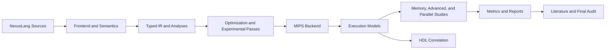

# Nexus Architecture

Nexus is organized as a layered educational platform with explicit seams between compiler work,
simulation work, HDL correlation, benchmarking, and final reporting.

## Layered View



## Major Layers

- `src/common`: metadata, banners, arithmetic helpers
- `src/compiler`: lexer/parser, AST, semantics, IR, analyses, passes, experimental parsing, backend
- `src/mips`: assembly representation and loader support
- `src/sim`: functional, single-cycle, multi-cycle, pipeline, advanced, memory/system, and parallel modes
- `src/hdl`: Verilog ALU, adder, iterative multiplier/divider, register file, control, pipeline register
- `src/benchmarks` and `benchmarks/`: build glue and source files for CPU and optional GPU demos
- `docs/`: theory, usage, reports, literature, and audit material

## End-To-End Flows

### Compiler Path

```text
NexusLang
  -> lexer/parser
  -> AST
  -> semantic analysis
  -> typed IR
  -> analyses and bounded passes
  -> MIPS assembly
  -> simulator modes
```

### HDL Correlation Path

```text
architecture docs + arithmetic helpers
  -> Verilog module design
  -> testbench simulation with iverilog/vvp
```

### Benchmark Path

```text
parallel simulator + OpenMP/MPI/SIMD/CUDA demos
  -> tiny CSV/markdown summaries
  -> validation and final reports
```

## Design Rules

- keep correctness-first models separate from timing/experimental ones
- keep production compiler flows separate from experimental parsing/optimization prototypes
- keep optional GPU work isolated behind a feature flag
- prefer deterministic tiny experiments over large, noisy runs
