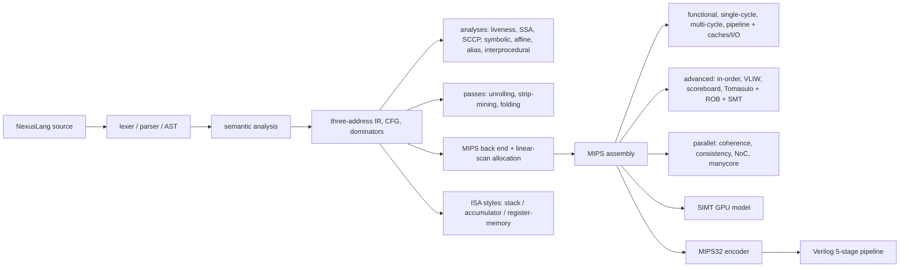

# Nexus Architecture

Nexus is one repository in layers: a compiler for NexusLang, a family of MIPS execution models from a
functional interpreter to an out-of-order core, parallel and GPU models, a synthesisable Verilog CPU,
and stand-alone tools for the theory topics (automata, grammars, types, polyhedra, arithmetic).

## Source Layout

| path | contents |
| --- | --- |
| `src/common` | build info, ALU helpers, FPU-lite, IEEE-754 soft float, number systems, UTF-8 |
| `src/compiler/frontend`, `semantics` | hand-written lexer and recursive-descent parser, AST, type checking, scopes |
| `src/compiler/ir` | typed three-address IR, lowering, printers (IR and quadruples) |
| `src/compiler/analysis` | CFG, dominators, data flow, liveness, region flow, symbolic, affine, alias, interprocedural, SSA/SCCP |
| `src/compiler/passes` | loop unrolling, affine strip-mining, interprocedural constant folding |
| `src/compiler/backend_mips` | MIPS code generation and linear-scan register allocation |
| `src/compiler/isa_styles` | stack (JVM-like), accumulator and register-memory (IA-32-like) back ends with interpreters |
| `src/compiler/experimental_parallel_parsing` | parallel top-level parsing, Flex/Bison LR parser |
| `src/compiler/formal` | regex/NFA/DFA/minimisation, grammars, LL(1), LR family, Earley, attributes |
| `src/compiler/types` | Hindley-Milner inference for a small ML |
| `src/compiler/polyhedral` | loop-nest dependence analysis and unimodular transformations |
| `src/mips` | ISA tables, assembly text model, loader, MIPS32 encoder |
| `src/sim/functional`, `single_cycle`, `multi_cycle`, `pipeline` | the core simulator ladder (hardwired and microcoded control, hazards, forwarding, prediction) |
| `src/sim/memory`, `io`, `metrics` | L1/L2 caches, memory-mapped I/O, interrupts, DMA, statistics |
| `src/sim/advanced` | trace-driven in-order, VLIW-lite, scoreboard and Tomasulo/ROB/SMT schedulers |
| `src/sim/parallel` | multicore with coherence, consistency, synchronisation and interconnects |
| `src/sim/simt` | warp-based SIMT GPU model |
| `src/hdl` | Verilog ALU, adder, multiplier, divider, register file, control, pipeline registers, CPU slice, pipelined CPU |
| `benchmarks/` | OpenMP, MPI, SIMD and optional CUDA programs |

## Design Rules

- every timing model must reproduce the functional result; `nexus_cross_model_differential` and the
  RTL co-simulation enforce this on every test program;
- theory tools are executable and checked against an independent reference (`std::regex`, host FPU,
  closed-form results, execution of original vs transformed loop nests);
- optional toolchains (OpenMP, MPI, CUDA, clang, Icarus Verilog, Yosys) never break the build; their
  tests are skipped or not registered when the tool is missing;
- HDL is plain Verilog-2005/SystemVerilog-2012 that Icarus Verilog simulates and Yosys synthesises.
