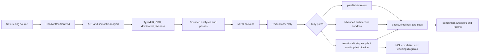
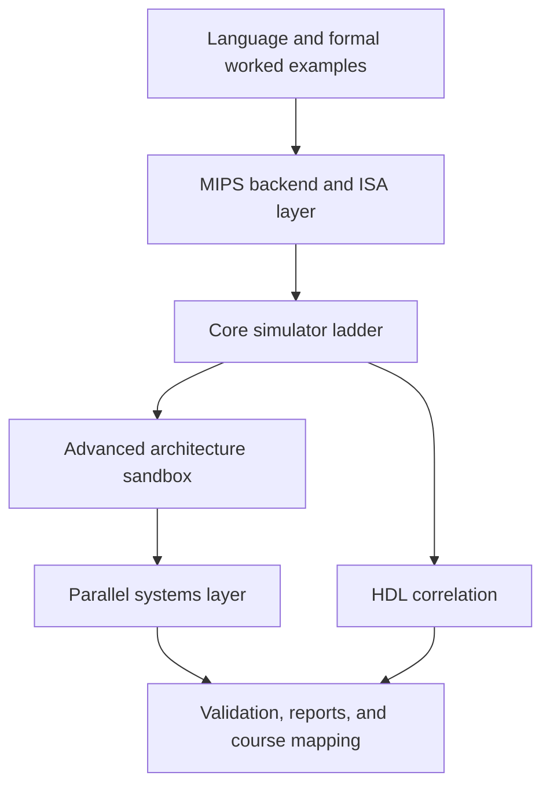

# Nexus

Nexus is a bounded educational/research-grade platform that connects compiler construction, MIPS
code generation, CPU and microarchitecture simulation, advanced architecture experiments, parallel
systems work, and HDL validation inside one repository. The project is intentionally broad, but the
documentation stays conservative: core compiler and simulator flows are fully implemented, several
later course-aligned slices are experimentally implemented, broader theory areas are documented with
worked examples, and a small set of industrial-scale topics remains explicitly outside bounded
scope.

## Project Metadata

| Field | Value |
| --- | --- |
| Author | George David Tsitlauri |
| Affiliation | Dept. of Informatics & Telecommunications, University of Thessaly, Greece |
| Contact | gdtsitlauri@gmail.com |
| Year | 2026 |

## Current Status

- phase label: `0.11.0-phase11`
- verified on: `2026-04-22`
- current low-memory validation: `56/56` tests passed with `ctest --output-on-failure -j1`
- CPU-only validation is the required baseline success path
- optional CUDA remains feature-gated behind `-DNEXUS_ENABLE_CUDA=ON`

Nexus uses four repository-wide status labels:

- `fully implemented`
- `experimentally implemented`
- `documented with worked examples`
- `still outside bounded scope`

## System At A Glance

| Layer | Main components | Status | Representative commands or entry points |
| --- | --- | --- | --- |
| Handwritten frontend and semantics | `src/compiler/frontend`, `src/compiler/semantics` | fully implemented | `./build/bin/nexusc lex <file>`, `./build/bin/nexusc check <file>` |
| IR, CFG, dominators, and baseline analysis | `src/compiler/ir`, `src/compiler/analysis` | fully implemented | `./build/bin/nexusc ir <file>`, `cfg`, `dom`, `analysis liveness` |
| Experimental compiler slices | `src/compiler/experimental_parallel_parsing`, `src/compiler/passes` | experimentally implemented | `experimental-parse --mode bison-lr`, `opt --analysis ...`, `opt --pass ...` |
| MIPS backend and loader path | `src/compiler/backend_mips`, `src/mips` | fully implemented | `./build/bin/nexusc compile <file> -S`, `./build/bin/mips-sim run <file> --mode functional` |
| Core simulator ladder | `src/sim/functional`, `single_cycle`, `multi_cycle`, `pipeline` | fully implemented | `./build/bin/mips-sim run <file> --mode functional|single-cycle|multi-cycle|pipeline` |
| Memory, cache, I/O, interrupts, and DMA | `src/sim/memory`, `src/sim/io` | experimentally implemented | pipeline `--cache ... --cache-l2 ... --stats`, `--io-demo`, `--interrupt-demo`, `--dma-demo` |
| Advanced architecture sandbox | `src/sim/advanced` | experimentally implemented | `./build/bin/mips-sim run <file> --mode advanced --scheduler scoreboard --predictor 2bit --stats` |
| Parallel systems layer | `src/sim/parallel`, `benchmarks/`, `parallel-bench` | experimentally implemented | `./build/bin/mips-sim run <file> --mode parallel ...`, `./parallel-bench --all --build-dir ./build --repo-root .` |
| HDL correlation | `src/hdl`, `hdl-test`, `scripts/test_hdl.sh` | experimentally implemented | `./hdl-test all`, `./hdl-test cpu-slice` |
| Literature, mapping, and audit trail | `docs/`, `docs/reports/` | documented with worked examples | `docs/reports/final_nexus_system_paper.md`, `validation_report.md`, `repository_wide_truth_audit.md` |

## End-to-End Flow



## Layered Repository View



## Repository Structure

| Directory | Purpose | Example contents |
| --- | --- | --- |
| `src/compiler` | language frontend, IR, analyses, passes, backend, and experimental parsing | `frontend/src/lexer.cpp`, `ir/src/lowering.cpp`, `analysis/src/dominators.cpp`, `passes/src/loop_unroll.cpp` |
| `src/mips` | assembly representation and loader support | `isa/src/instruction.cpp`, `loader/src/parser.cpp` |
| `src/sim` | execution models, memory/system support, metrics, advanced sandbox, and parallel layer | `functional/src/interpreter.cpp`, `pipeline/src/model.cpp`, `advanced/src/model.cpp`, `parallel/src/model.cpp` |
| `src/hdl` | Verilog modules and bounded CPU slice | `alu/nexus_alu.v`, `control/nexus_control_unit.v`, `cpu_slice/nexus_cpu_slice.v` |
| `benchmarks` | OpenMP, MPI, SIMD, and optional CUDA demos | `openmp/openmp_bench.cpp`, `gpu_optional/gpu_optional_bench.cu` |
| `examples` | NexusLang and formal worked examples | `source_lang/factorial.nx`, `formal/grammar_worked_example.md` |
| `tests` | unit, integration, golden, HDL, and doc/audit validation | `unit/pipeline_model_test.cpp`, `golden/pipeline_trace.stdout.txt`, `integration/nexusc_cli_test.py` |
| `scripts` | build/test/report helpers | `test_hdl.sh`, `parallel_bench.py`, `run_advanced_experiments.py` |
| `tools` | small adjunct workflows | `toolchain_compare/run_toolchain_compare.py` |
| `docs` | architecture notes, theory notes, reports, and audits | `microarchitecture/pipeline.md`, `parallel/overview.md`, `reports/final_nexus_system_paper.md` |

## CLI Tools

| Tool | Purpose | Representative usage |
| --- | --- | --- |
| `./build/bin/nexusc` | frontend views, IR views, bounded optimization/analysis, and MIPS emission | `./build/bin/nexusc compile examples/source_lang/factorial.nx -S -o /tmp/nexus_factorial.s` |
| `./build/bin/mips-sim` | floating/fixed-point demo plus six simulator modes | `./build/bin/mips-sim run /tmp/nexus_factorial.s --mode functional --stats` |
| `./parallel-bench` | tiny OpenMP, MPI, SIMD, parallel-simulator, and optional GPU wrapper | `./parallel-bench --all --build-dir ./build --repo-root .` |
| `./hdl-test` | HDL test helper over the Verilog suites | `./hdl-test all` |

## Simulator Modes

| Mode | What it demonstrates | Status | Notes |
| --- | --- | --- | --- |
| `functional` | correctness-first ISA execution | fully implemented | no timing overlap; reference path for later models |
| `single-cycle` | one-instruction-per-cycle datapath/control view | fully implemented | hardwired control decoding is explicit |
| `multi-cycle` | per-instruction state sequencing | fully implemented | supports both `--control hardwired` and `--control microcode` |
| `pipeline` | 5-stage overlap, hazards, forwarding, stalls, flushes, branch effects, trace/timeline | fully implemented | supports `--trace`, `--timeline`, static predictors, and cache options |
| `advanced` | width experiments, VLIW-lite, scoreboard, bounded speculation penalties | experimentally implemented | includes `--scheduler inorder|vliw-lite|scoreboard` and predictor experiments |
| `parallel` | multicore, coherence-lite, consistency-lite, synchronization, and interconnect-lite | experimentally implemented | supports `--coherence`, `--consistency`, and `--interconnect` |

## Course Coverage Snapshot

| Course | Main repository evidence | Overall classification |
| --- | --- | --- |
| Principles of Computer Operation | MIPS path, ISA comparisons, arithmetic helpers, HDL arithmetic modules, FPU-lite demo | experimentally implemented |
| Computer Organization | single-cycle, multi-cycle, pipeline, control models, caches, I/O, interrupts, DMA, HDL support | experimentally implemented |
| Compilers | handwritten lexer/parser, AST, semantics, IR, code generation, end-to-end compile/run flow | fully implemented |
| Computer Architecture | Amdahl evaluation, predictors, VLIW-lite, scoreboard, coherence/consistency-lite, literature integration | experimentally implemented |
| Advanced Compiler Topics | parallel parsing, Flex/Bison LR path, CFG/dominators/data-flow, symbolic/affine/alias/interprocedural work | experimentally implemented |
| Parallel Systems and Parallel Programming | parallel simulator, OpenMP, MPI, SIMD, optional GPU path, bus/switch/NoC-lite, docs on taxonomy | experimentally implemented |

For the detailed per-topic classification, see:

- `docs/reports/full_syllabus_checklist.md`
- `docs/reports/course_mapping.md`
- `docs/reports/repository_wide_truth_audit.md`

## Validation Snapshot

| Item | Current state | Evidence |
| --- | --- | --- |
| Build tree reuse | `ninja -j2` completes with `ninja: no work to do.` | `docs/reports/validation_report.md` |
| Full low-memory suite | `56/56` passed | `ctest --output-on-failure -j1` |
| CPU-only baseline | required and validated | final audit/report set |
| Optional CUDA path | cleanly feature-gated | `-DNEXUS_ENABLE_CUDA=ON` and optional `gpu-bench` |
| GPU status in CPU-only run | clean skip | `suite=gpu kernel=vector-add status=skipped reason=cuda-disabled` |
| Final audit/report trail | present and cross-linked | final paper, checklist, mapping, truth audit, validation report |

## Key Commands

Configure and build:

```bash
cmake -S . -B build -G Ninja
cd build
ninja -j2
```

Optional CUDA build:

```bash
cmake -S . -B build-cuda -G Ninja -DNEXUS_ENABLE_CUDA=ON
cd build-cuda
ninja -j2
```

Full low-memory test run:

```bash
cd build
ctest --output-on-failure -j1
```

Compiler and simulator help:

```bash
./build/bin/nexusc --help
./build/bin/mips-sim --help
```

Compile and run the factorial example:

```bash
./build/bin/nexusc compile examples/source_lang/factorial.nx -S -o /tmp/nexus_factorial.s
./build/bin/mips-sim run /tmp/nexus_factorial.s --mode functional --stats
```

Representative trace and timeline commands:

```bash
./build/bin/mips-sim run tests/golden/pipeline_branch_demo.s --mode pipeline --predictor static-not-taken --trace
./build/bin/mips-sim run tests/golden/pipeline_branch_demo.s --mode pipeline --predictor static-not-taken --timeline
./build/bin/mips-sim run tests/golden/trace_demo.s --mode multi-cycle --control microcode --trace
```

Parallel wrapper and HDL helper:

```bash
./parallel-bench --all --build-dir ./build --repo-root .
./hdl-test all
```

## Representative Results And Examples

Representative functional run:

```text
Mode: functional
Program exited with code 120
Instructions: 203
Cycles: 203
```

Representative pipeline branch-trace line showing forwarding, a misprediction, and a flush:

```text
trace[pipeline]: cycle=4 IF=I3@pc3:addiu ID=I2@pc2:addiu EX=I1@pc1:beq MEM=I0@pc0:addiu WB=- events=forward(rs<-EX/MEM(I0@pc0:addiu)); forward(rt<-EX/MEM(I0@pc0:addiu)); mispredict(beq -> pc=3); flush(ID:I2@pc2:addiu)
```

Representative timeline excerpt:

```text
I0@pc0:addiu | IF | ID | EX | MEM | WB
I1@pc1:beq   | .  | IF | ID | EX  | MEM | WB
I2@pc2:addiu | .  | .  | IF | ID!
```

Representative benchmark-wrapper summary:

```text
suite=openmp kernel=vector-add checksum=360 status=ok
suite=mpi kernel=reduce checksum=110 status=ok
suite=simd kernel=vector-add checksum=1488 status=ok
suite=parallel case=coherence-demo cycles=9 status=ok
suite=gpu kernel=vector-add status=skipped reason=cuda-disabled
```

Representative multi-cycle microcode trace:

```text
trace[multi-cycle]: cycle=1 control=microcode state=fetch pc=0 opcode=addiu signals={ir_write, mem_read, pc_write} action=microcode IF
trace[multi-cycle]: cycle=2 control=microcode state=decode pc=0 opcode=addiu signals={reg_read} action=microcode ID
trace[multi-cycle]: cycle=3 control=microcode state=execute-imm pc=0 opcode=addiu signals={alu} action=microcode EXI: ALUOut <- f(A, imm)
```

## Final Reports

- final paper: `docs/reports/final_nexus_system_paper.md`
- validation record: `docs/reports/validation_report.md`
- course mapping: `docs/reports/course_mapping.md`
- detailed checklist: `docs/reports/full_syllabus_checklist.md`
- repository-wide truth audit: `docs/reports/repository_wide_truth_audit.md`
- status snapshot: `STATUS.md`
- roadmap snapshot: `ROADMAP.md`

## Honest Boundaries

- the core handwritten compiler path and the baseline simulator ladder are the stable instructional core
- FPU-lite, L1+L2, Flex/Bison LR parsing, scoreboard scheduling, affine/locality work, the optional GPU path, and the HDL CPU slice are bounded executable experiments
- several theory-heavy areas are covered through documentation and worked examples rather than executable industrial implementations
- CUDA is optional, not mandatory
- HDL coverage stops at validated modules and a bounded CPU slice, not a full synthesizable CPU
- Tomasulo-style execution, reorder buffers, industrial SSA/register allocation, generalized ambiguity-supporting parsing, and large manycore research infrastructure remain outside bounded scope
