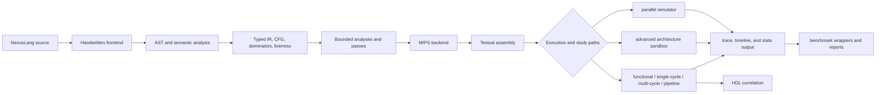
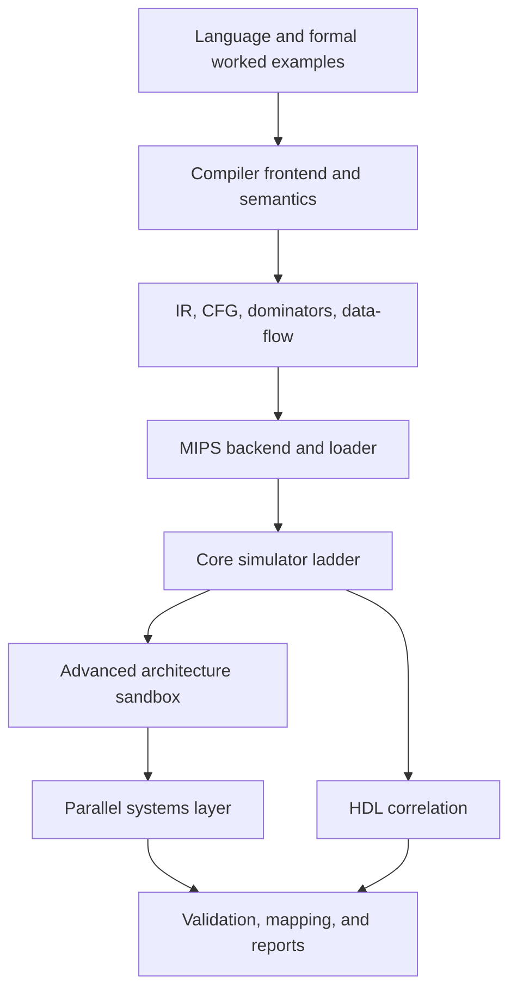
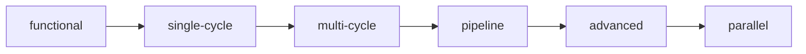
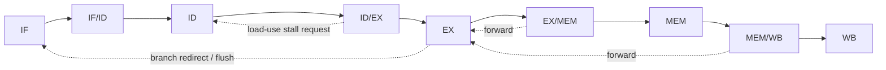
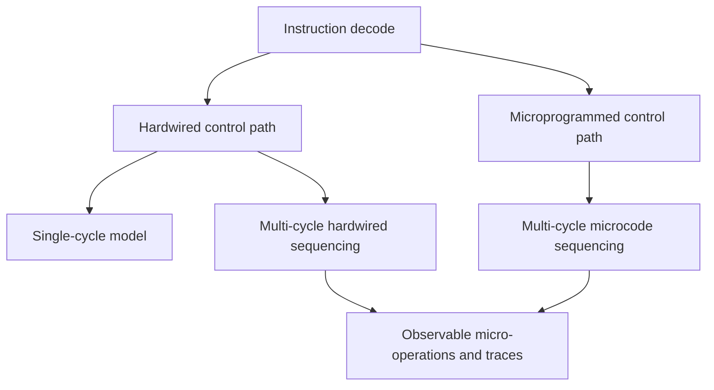
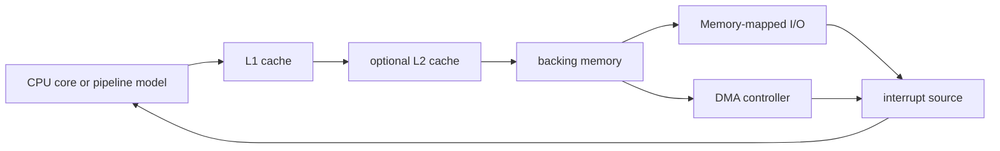
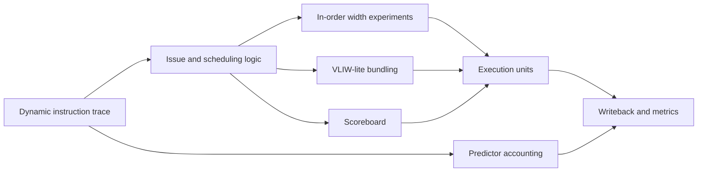
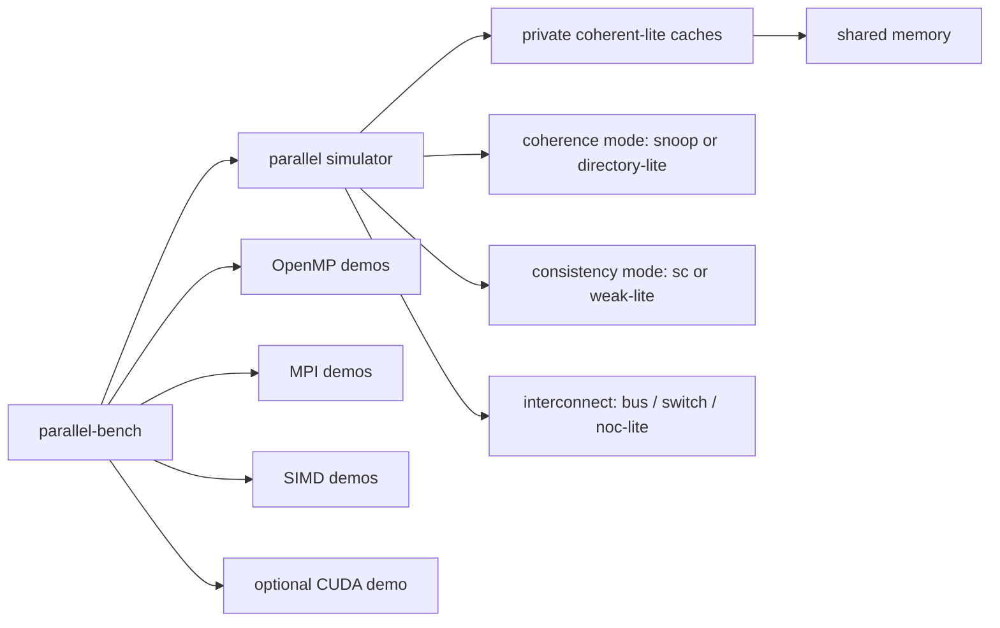
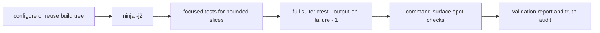

# Nexus: A Bounded Educational/Research-Grade Platform for Compiler Construction, MIPS Execution, Architecture Studies, Parallel Systems, and HDL Correlation

**Author:** George David Tsitlauri  
**Affiliation:** Dept. of Informatics & Telecommunications, University of Thessaly, Greece  
**Contact:** gdtsitlauri@gmail.com  
**Year:** 2026

## 1. Abstract

Nexus is a single repository that connects six teaching domains: Principles of Computer Operation,
Computer Organization, Compilers, Computer Architecture, Advanced Compiler Topics, and Parallel
Systems and Parallel Programming. The implemented core consists of a handwritten NexusLang
frontend, a typed non-SSA IR, CFG and dominator infrastructure, a bounded MIPS backend, and a
ladder of execution models from functional interpretation through single-cycle, multi-cycle, and
5-stage pipelined simulation. Around that stable core, the repository adds bounded experimental
slices for Flex/Bison LR parsing, FPU-lite arithmetic demos, L1 plus optional L2 cache studies,
scoreboard scheduling, affine/locality-oriented compiler passes, coherence-lite and
consistency-lite multicore simulation, tiny OpenMP/MPI/SIMD integrations, an optional CUDA path,
and HDL modules plus a CPU slice.

The repository is intentionally conservative about what it claims. Each topic is classified as
`fully implemented`, `experimentally implemented`, `documented with worked examples`, or `still
outside bounded scope`. Final low-memory validation on 2026-04-22 reused the existing `build/`
tree, completed with `ninja -j2`, and passed `56/56` tests with
`ctest --output-on-failure -j1`. In CPU-only validation, the optional GPU path correctly reported
`suite=gpu kernel=vector-add status=skipped reason=cuda-disabled`, which is treated as success
because CUDA remains explicitly optional.

## 2. Introduction

Nexus was built as a coherent teaching platform rather than as six disconnected mini-projects. The
design goal was to let a small source language travel through real compiler stages, emit real MIPS
assembly, execute inside multiple architectural models, connect to bounded parallel-system studies,
and correlate selected datapath/control ideas with HDL artifacts. That makes the repository useful
both as a project submission and as a review surface for a professor who wants to inspect code,
tests, command-line tools, and final reports in one place.

The project does not claim industrial completeness. Instead, it aims for bounded
educational/research-grade coverage: the stable baseline is executable and tested, several advanced
topics are present as deliberately small experiments, theory-heavy topics are documented with
worked examples, and a short list of large industrial topics is kept explicitly out of scope.

## 3. Problem Statement and Educational/Research Motivation

The six target courses overlap heavily in practice, but they are often taught through different
artifacts. Compilers emphasize grammars, ASTs, IRs, and code generation. Organization and
architecture emphasize datapaths, control, pipelines, memory systems, and performance reasoning.
Parallel-systems material introduces shared-memory versus distributed-memory viewpoints, coherence,
consistency, synchronization, and accelerator models. HDL work often appears as a separate lab
track. A major motivation for Nexus was to put these themes on a common bounded execution path.

The educational tradeoff is important. A repository that attempted full industrial depth in all six
domains would become too large to review and too brittle to validate in a small teaching
environment. Nexus therefore makes three deliberate choices:

1. keep one correctness-first compiler and simulator baseline as the stable core;
2. add advanced topics as inspectable prototypes rather than oversized frameworks; and
3. preserve an explicit truth boundary between executable coverage, documentation-backed coverage,
   and out-of-scope material.

## 4. Repository and System Overview

### 4.1 Status Vocabulary

- `fully implemented`: real code exists, it builds, participates in repository flow, and has at
  least some test, example, or documentation validation
- `experimentally implemented`: real code exists, but it is intentionally bounded, optional,
  partial, or simplified relative to industrial scope
- `documented with worked examples`: the repository explains the topic with notes, examples, or
  literature integration, but it does not ship a full validated implementation
- `still outside bounded scope`: the topic is intentionally left beyond the final repository scope

### 4.2 Repository Subsystem Table

| Subsystem | Main directories/files | Role | Classification |
| --- | --- | --- | --- |
| Handwritten frontend and AST | `src/compiler/frontend/src/lexer.cpp`, `parser.cpp`, `ast_printer.cpp` | tokenization, parsing, AST construction, diagnostics | fully implemented |
| Semantic analysis | `src/compiler/semantics/src/semantic_analyzer.cpp` | symbol checking, type checking, language validity checks | fully implemented |
| IR and analyses | `src/compiler/ir/`, `src/compiler/analysis/src/cfg.cpp`, `dominators.cpp`, `liveness.cpp` | typed IR, CFGs, dominators, iterative data-flow | fully implemented |
| Experimental compiler slices | `src/compiler/experimental_parallel_parsing/`, `src/compiler/passes/`, `symbolic.cpp`, `affine_analysis.cpp`, `interprocedural.cpp` | LR comparison path, symbolic/alias/affine/interproc studies | experimentally implemented |
| MIPS backend and loader | `src/compiler/backend_mips/src/codegen.cpp`, `src/mips/` | bounded code generation, assembly representation, loader support | fully implemented |
| Core simulator ladder | `src/sim/functional/`, `single_cycle/`, `multi_cycle/`, `pipeline/` | executable refinement ladder for ISA, datapath, control, and pipelining | fully implemented |
| Memory and system layer | `src/sim/memory/src/system.cpp`, `src/sim/io/src/system.cpp` | cache studies, L1/L2, I/O, interrupts, DMA, metrics | experimentally implemented |
| Advanced architecture sandbox | `src/sim/advanced/src/model.cpp`, `predictor.cpp` | bounded scheduling, width experiments, predictor accounting | experimentally implemented |
| Parallel systems layer | `src/sim/parallel/src/model.cpp`, `benchmarks/`, `parallel-bench` | multicore/coherence-lite/consistency-lite plus benchmark wrappers | experimentally implemented |
| HDL correlation | `src/hdl/alu/`, `register_file/`, `control/`, `pipeline_regs/`, `cpu_slice/` | module/testbench validation and bounded CPU slice | experimentally implemented |
| Reports and audit trail | `README.md`, `STATUS.md`, `docs/reports/` | final mapping, validation, truth audit, and explanatory material | documented with worked examples |

### 4.3 End-to-End Nexus Flow



### 4.4 Layered Architecture View



This layered view matches `ARCHITECTURE.md` and the actual source tree: `src/compiler` feeds
`src/mips`, which feeds the simulator family in `src/sim`, while `src/hdl`, `benchmarks/`, and
`docs/reports/` extend the same bounded teaching pipeline rather than forming separate projects.

## 5. Phase-by-Phase Evolution

| Phase | Main outcome | Representative evidence |
| --- | --- | --- |
| 1 | repository bootstrap, CMake/Ninja scaffolding | `CMakeLists.txt`, `cmake/`, `Makefile` |
| 2 | language definition, frontend, AST, semantics | `src/compiler/frontend/`, `src/compiler/semantics/` |
| 3 | IR, CFG, dominators, baseline analyses | `src/compiler/ir/`, `src/compiler/analysis/` |
| 4 | MIPS backend and functional execution | `src/compiler/backend_mips/`, `src/sim/functional/` |
| 5 | single-cycle and multi-cycle organization models | `src/sim/single_cycle/`, `src/sim/multi_cycle/` |
| 6 | 5-stage pipeline, hazards, forwarding, branch handling | `src/sim/pipeline/`, `docs/microarchitecture/pipeline.md` |
| 7 | memory/cache/I/O/interrupt/DMA support and metrics | `src/sim/memory/`, `src/sim/io/` |
| 8 | advanced architecture sandbox and Amdahl evaluation | `src/sim/advanced/`, `docs/reports/amdahl_evaluation.md` |
| 9 | advanced compiler prototypes and comparison material | `experimental_parallel_parsing/`, `affine_analysis.cpp`, `interprocedural.cpp` |
| 10 | multicore/parallel simulation and parallel wrappers | `src/sim/parallel/`, `benchmarks/`, `parallel-bench` |
| 11 | HDL modules/testbenches, optional GPU path, literature completion, final validation | `src/hdl/`, `benchmarks/gpu_optional/`, `docs/reports/validation_report.md` |

The phase structure in `ROADMAP.md` remains visible in the final repository. Earlier phases provide
the stable execution path, while later phases add bounded experiments and the final audit/report
surface.

## 6. Compiler Architecture

The compiler side of Nexus is the strongest fully implemented subsystem in the repository. The
default production path is handwritten and deterministic. Generated parsing is present only as a
comparison track.

### 6.1 Compiler Pipeline Diagram


### 6.2 Compiler Pipeline Table

| Stage | Implemented artifacts | Output | Validation evidence |
| --- | --- | --- | --- |
| Lexical analysis | `lexer.cpp`, `token.cpp`, diagnostics | token stream | `tests/unit/frontend_lexer_test.cpp`, `nexusc lex` |
| Syntax analysis | `parser.cpp`, AST headers | AST | `tests/unit/frontend_parser_test.cpp`, `nexusc parse`, `nexusc ast` |
| Semantic analysis | `semantic_analyzer.cpp` | validated AST with symbol/type checks | `tests/unit/frontend_semantics_test.cpp`, `nexusc check` |
| IR lowering | `src/compiler/ir/src/lowering.cpp` | typed non-SSA IR | `tests/unit/ir_lowering_test.cpp`, `nexusc ir` |
| CFG and dominators | `cfg.cpp`, `dominators.cpp` | basic blocks, dominator tree data | `tests/unit/cfg_analysis_test.cpp`, `nexusc cfg`, `nexusc dom` |
| Data-flow and liveness | `data_flow.cpp`, `liveness.cpp` | iterative analysis facts | `nexusc analysis liveness`, analysis tests |
| Experimental analyses and passes | `symbolic.cpp`, `region_flow.cpp`, `alias_analysis.cpp`, `loop_unroll.cpp`, `affine_stripmine.cpp`, `interprocedural_pass.cpp` | bounded optimization or analysis results | `symbolic_analysis_test`, `alias_analysis_test`, `unroll_pass_test`, `affine_analysis_test`, `interproc_test` |
| Experimental parsing comparison | `flex_bison_lexer.l`, `flex_bison_parser.y`, `bison_lr.cpp`, `prototype.cpp` | LR and parallel-parse experiments | `experimental_parse_test`, `nexusc experimental-parse --mode parallel|bison-lr` |
| Code generation | `backend_mips/src/codegen.cpp` | MIPS assembly | `backend_mips_test`, CLI compile/run flow |

### 6.3 Representative Compiler Commands

```bash
./build/bin/nexusc --help
./build/bin/nexusc lex examples/source_lang/factorial.nx
./build/bin/nexusc dom examples/source_lang/factorial.nx
./build/bin/nexusc experimental-parse examples/source_lang/factorial.nx --mode bison-lr
./build/bin/nexusc compile examples/source_lang/factorial.nx -S -o /tmp/nexus_factorial.s
```

The key truth boundary is straightforward: the handwritten compiler path is `fully implemented`,
while Flex/Bison LR parsing and the broader advanced optimization suite are `experimentally
implemented`.

## 7. MIPS Backend and Execution Flow

The MIPS path is the repository’s execution backbone. It makes compiler output inspectable, gives
the simulator ladder a shared input form, and satisfies the machine-level emphasis of the first
three courses.

### 7.1 MIPS/Backend Support Table

| Area | Support in repo | Evidence | Notes |
| --- | --- | --- | --- |
| textual assembly emission | yes | `nexusc compile -S`, `backend_mips/src/codegen.cpp` | bounded assembly syntax |
| arithmetic and compare instructions | yes | backend lowering, functional tests | educational MIPS subset |
| loads, stores, addressing | yes | backend, loader, simulator tests | enough for arrays and stack data |
| calls and returns | yes | stack-frame lowering, `jal`/`jr`, call tests | real subroutine path |
| stack-frame layout | yes | backend lowering and docs | no separate frame-optimization pass |
| loader support | yes | `src/mips/`, `mips_loader_test.cpp` | consumes emitted assembly |
| end-to-end compile/run flow | yes | `nexusc` plus `mips-sim` | stable instructional path |
| full industrial ISA coverage | no | bounded subset only | still outside bounded scope |

### 7.2 Representative End-to-End Run

Command pair:

```bash
./build/bin/nexusc compile examples/source_lang/factorial.nx -S -o /tmp/nexus_factorial.s
./build/bin/mips-sim run /tmp/nexus_factorial.s --mode functional --stats
```

Representative output:

```text
Mode: functional
Program exited with code 120
Instructions: 203
Cycles: 203
```

This output is intentionally small, but it is valuable: it shows that the compiler, backend,
loader, and functional interpreter work together on a nontrivial recursive example.

## 8. CPU and Microarchitecture Models

Nexus uses a refinement ladder rather than a single giant simulator. That decision keeps the core
models easy to inspect and lets later models reuse earlier correctness assumptions.

### 8.1 Simulator Refinement Ladder Diagram



### 8.2 Simulator Ladder Table

| Mode | Abstraction level | Covered concepts | Validation |
| --- | --- | --- | --- |
| `functional` | ISA-first reference execution | instruction behavior, stack/calls, correctness baseline | `mips_functional_test`, end-to-end factorial run |
| `single-cycle` | one instruction per cycle | datapath/control view, hardwired decode | `single_cycle_model_test`, golden traces |
| `multi-cycle` | sequential control-state execution | micro-operations, sequencing, hardwired vs microcode control | `multi_cycle_model_test`, trace and stats output |
| `pipeline` | 5-stage overlap | hazards, forwarding, stalls, flushes, branch effects, trace/timeline | `pipeline_model_test`, golden trace/timeline outputs |
| `advanced` | bounded architecture sandbox | predictor experiments, width studies, VLIW-lite, scoreboard | `advanced_predictor_test`, `advanced_model_test` |
| `parallel` | bounded multicore/shared-memory model | coherence-lite, consistency-lite, synchronization, interconnect-lite | `parallel_model_test`, `coherence_model_test`, `consistency_model_test` |

### 8.3 Pipeline Behavior Diagram



### 8.4 Pipeline Behavior Table

| Topic | Repository support | Evidence | Classification |
| --- | --- | --- | --- |
| hazards | explicit 5-stage hazard handling | `src/sim/pipeline/src/model.cpp`, `tests/unit/pipeline_model_test.cpp` | fully implemented |
| forwarding | EX/MEM and MEM/WB forwarding paths | trace output, pipeline tests, `docs/microarchitecture/pipeline.md` | fully implemented |
| stalls | bounded load-use stall insertion | timeline markers such as `ID*`, stats counters | fully implemented |
| flushes | control flush handling for mispredicted younger instructions | trace output, timeline markers such as `ID!` | fully implemented |
| branch effects | static prediction, redirect, misprediction accounting | `docs/microarchitecture/branch_prediction.md`, stats, tests | fully implemented |
| tracing and timeline output | `--trace` and `--timeline` modes | golden outputs in `tests/golden/` | fully implemented |

Representative pipeline branch-trace line:

```text
trace[pipeline]: cycle=4 IF=I3@pc3:addiu ID=I2@pc2:addiu EX=I1@pc1:beq MEM=I0@pc0:addiu WB=- events=forward(rs<-EX/MEM(I0@pc0:addiu)); forward(rt<-EX/MEM(I0@pc0:addiu)); mispredict(beq -> pc=3); flush(ID:I2@pc2:addiu)
```

Representative timeline excerpt:

```text
I0@pc0:addiu | IF | ID | EX | MEM | WB
I1@pc1:beq   | .  | IF | ID | EX  | MEM | WB
I2@pc2:addiu | .  | .  | IF | ID!
```

Representative pipeline stats excerpt:

```text
Mode: pipeline
Predictor: static-not-taken
Program exited with code 7
Instructions: 4
Cycles: 9
CPI: 2.25
IPC: 0.44
Flushes: 1
Forwardings: 2
Branch predictions: 1
Branch mispredictions: 1
```

### 8.5 Control-Model Diagram



### 8.6 Control-Model Table

| Control style | Repository support | Evidence | Notes |
| --- | --- | --- | --- |
| hardwired control | yes | `src/sim/single_cycle/src/control.cpp`, `src/sim/multi_cycle/src/control.cpp`, HDL control unit | present in single-cycle and multi-cycle paths |
| microprogrammed control | yes | `--control microcode`, `src/sim/multi_cycle/src/control.cpp`, traces and stats | bounded microcode store model |

Representative microcode trace excerpt:

```text
trace[multi-cycle]: cycle=1 control=microcode state=fetch pc=0 opcode=addiu signals={ir_write, mem_read, pc_write} action=microcode IF
trace[multi-cycle]: cycle=2 control=microcode state=decode pc=0 opcode=addiu signals={reg_read} action=microcode ID
trace[multi-cycle]: cycle=3 control=microcode state=execute-imm pc=0 opcode=addiu signals={alu} action=microcode EXI: ALUOut <- f(A, imm)
```

The presence of both hardwired and microprogrammed control is therefore evidence-backed by code,
CLI options, trace output, and tests. It is not merely a documentation claim.

## 9. Memory, Cache, I/O, Interrupts, DMA, and System Support

Nexus keeps memory and system modeling intentionally small, but it moves beyond pure CPU pipelines.
The repository contains executable studies for cache behavior, optional L2 support, I/O, timer
interrupts, DMA, and memory-related metrics.

### 9.1 Memory-System Diagram



### 9.2 Memory-System Table

| Topic | Repository support | Evidence | Classification |
| --- | --- | --- | --- |
| cache hierarchy | bounded cache modeling | `src/sim/memory/src/system.cpp`, cache docs, cache tests | experimentally implemented |
| L1/L2 | L1 plus optional L2 hierarchy | `memory_cache_test`, `pipeline_memory_system_test`, CLI `--cache-l2` | experimentally implemented |
| I/O | memory-mapped educational I/O | `src/sim/io/src/system.cpp`, `io_system_test.cpp`, demos | experimentally implemented |
| interrupts | timer interrupt demonstration | golden `interrupt_demo.s`, tests, CLI support | experimentally implemented |
| DMA | deterministic DMA demonstration | golden `dma_demo.s`, tests, system code | experimentally implemented |
| metrics | stats counters and report helpers | `src/sim/metrics/`, `--stats` output | experimentally implemented |

Representative cache/system stats excerpt:

```text
L1 miss @0
L2 miss @0
Mode: pipeline
Cache: direct-mapped + L2 2-way set-associative
Program exited with code 5
Cycles: 12
Stalls: 3
Load-use stalls: 2
Forwardings: 3
Memory accesses: 2
Cache hits: 1
```

This is a bounded memory-system study, not a full industrial cache simulator. The classification is
therefore `experimentally implemented`, not `fully implemented`.

## 10. Advanced Architecture Sandbox

The advanced sandbox is where Nexus moves from stable instructional CPU models into deliberately
small research-style experiments. The key point is that these experiments are executable and
test-backed, but they do not claim full out-of-order or superscalar industrial complexity.

### 10.1 Advanced Scheduling Diagram



### 10.2 Advanced Architecture Table

| Topic | Support in repo | Evidence | Classification |
| --- | --- | --- | --- |
| scoreboard | executable bounded scheduler | `src/sim/advanced/src/model.cpp`, `advanced_model_test.cpp`, CLI support | experimentally implemented |
| branch prediction | static-not-taken and `2bit` predictors | `predictor.cpp`, predictor tests, stats output | fully implemented |
| speculative behavior | bounded speculative flush-cycle accounting | advanced model docs, stats behavior | experimentally implemented |
| static scheduling / VLIW | width studies and `vliw-lite` scheduler | `docs/microarchitecture/advanced_scheduling.md`, advanced-mode traces/tests | experimentally implemented |
| Tomasulo / reservation-station concepts | documented in architecture notes | `docs/microarchitecture/advanced_scheduling.md` | documented with worked examples |
| out-of-order concepts | documented conceptually only | advanced scheduling docs | documented with worked examples |
| Amdahl-related evaluation | scripts and final report material | `docs/reports/amdahl_evaluation.md`, integration test | experimentally implemented |

Documented bounded result from `docs/microarchitecture/advanced_scheduling.md`:

```text
in-order width 2: 5 cycles
VLIW-lite: 4 cycles
```

The sandbox stays honest about its limit: no renaming, no reorder buffer, no Tomasulo-style
broadcast network, and no industrial wakeup/select engine.

## 11. Parallel Systems Layer

The parallel layer extends Nexus into shared-memory and distributed-memory teaching territory while
keeping the implementation small enough to validate in a classroom-friendly environment.

### 11.1 Parallel-System Diagram



### 11.2 Parallel Systems Table

| Topic | Support in repo | Evidence | Classification |
| --- | --- | --- | --- |
| shared memory | bounded multicore simulator | `src/sim/parallel/src/model.cpp`, `parallel_model_test.cpp` | experimentally implemented |
| distributed memory | tiny MPI benchmark path | `benchmarks/mpi/mpi_bench.cpp`, wrapper/tests/docs | experimentally implemented |
| coherence | `snoop` and `directory-lite` modes | `coherence_model_test.cpp`, CLI options, demos | experimentally implemented |
| consistency | `sc` and `weak-lite` modes | `consistency_model_test.cpp`, demos | experimentally implemented |
| synchronization | barriers, atomics, lock-style operations | parallel tests, demos, wrapper | experimentally implemented |
| OpenMP | tiny kernels in `openmp_bench.cpp` | wrapper, tests, docs | experimentally implemented |
| MPI | tiny kernels in `mpi_bench.cpp` | wrapper, tests, docs | experimentally implemented |
| SIMD | vector-add and dot-product kernels | `simd_bench.cpp`, wrapper/tests | experimentally implemented |
| GPU | optional CUDA path and wrapper integration | `gpu_optional_bench.cu`, clean skip validation | experimentally implemented |
| buses / switches / NoC | interconnect-lite comparison | CLI `--interconnect bus|switch|noc-lite`, tests/docs | experimentally implemented |

Representative parallel simulator excerpt:

```text
coherence[snoop]: core0 invalidated 1 sharer(s) at address 0 penalty=3
sync[barrier-arrive]: core1
sync[barrier-arrive]: core0
sync[barrier-release]: released all participating cores
Mode: parallel
Cores: 2
Coherence: snoop
Consistency: sc
Interconnect: bus
```

Representative wrapper summary:

```text
suite=openmp kernel=vector-add checksum=360 status=ok
suite=mpi kernel=reduce checksum=110 status=ok
suite=simd kernel=vector-add checksum=1488 status=ok
suite=parallel case=coherence-demo cycles=9 status=ok
suite=gpu kernel=vector-add status=skipped reason=cuda-disabled
```

Taxonomy topics such as SMT and asymmetric multiprocessors are still present only as explanatory
documentation in `docs/parallel/overview.md`.

## 12. HDL Integration

The HDL layer provides bounded hardware correlation artifacts rather than a full synthesizable CPU.
That distinction matters: the modules and testbenches are real and validated, but the repository
stops short of claiming a production-grade processor implementation.

### 12.1 HDL Table

| Area | Modules/testbenches | Status | Notes |
| --- | --- | --- | --- |
| ALU | `src/hdl/alu/nexus_alu.v`, `alu_tb.v` | experimentally implemented | core arithmetic/logic teaching module |
| Adder | `src/hdl/alu/nexus_adder.v`, `adder_tb.v` | experimentally implemented | standalone arithmetic building block |
| Multiplier | `src/hdl/alu/nexus_iterative_multiplier.v`, `iterative_multiplier_tb.v` | experimentally implemented | iterative educational design |
| Divider | `src/hdl/alu/nexus_iterative_divider.v`, `iterative_divider_tb.v` | experimentally implemented | iterative educational design |
| Register file | `src/hdl/register_file/nexus_register_file.v`, `register_file_tb.v` | experimentally implemented | bounded architectural register storage |
| Control unit | `src/hdl/control/nexus_control_unit.v`, `control_unit_tb.v` | experimentally implemented | complements simulator control discussions |
| Pipeline registers | `src/hdl/pipeline_regs/nexus_pipeline_reg.v`, `pipeline_reg_tb.v` | experimentally implemented | correlates with the 5-stage pipeline view |
| CPU slice | `src/hdl/cpu_slice/nexus_cpu_slice.v`, `cpu_slice_tb.v` | experimentally implemented | bounded teaching slice, not a full synthesizable CPU |

Representative helper command:

```bash
./hdl-test all
```

HDL support therefore satisfies the course requirement only in bounded lab-style form.

## 13. Optional GPU Path

The repository includes a real optional CUDA benchmark/demo source in
`benchmarks/gpu_optional/gpu_optional_bench.cu`, but CPU-only success is the required baseline.
This is one of the clearest examples of the repository’s truthfulness rule: the path exists, but it
is intentionally feature-gated and not required for a passing final validation.

Optional configure/build path:

```bash
cmake -S . -B build-cuda -G Ninja -DNEXUS_ENABLE_CUDA=ON
cd build-cuda
ninja -j2
```

Representative CPU-only validation result:

```text
suite=gpu kernel=vector-add status=skipped reason=cuda-disabled
```

That outcome is treated as success in the final audit because CUDA is optional and not mandatory.

## 14. Verification and Testing Methodology

Verification in Nexus combines unit tests, integration tests, golden output checks, CLI spot
checks, HDL tests, and report/audit validation. The repository’s final validation strategy is
intentionally low-memory and deterministic.

### 14.1 Testing Strategy Table

| Test layer | Scope | Example test targets |
| --- | --- | --- |
| unit tests | compiler, ISA, arithmetic, simulator submodels, analyses | `frontend_lexer_test`, `pipeline_model_test`, `memory_cache_test`, `advanced_model_test` |
| integration tests | CLI entry points, wrappers, reports, cross-subsystem workflows | `nexusc_cli_test.py`, `parallel_benchmark_modes_test.py`, `gpu_optional_test.py`, `final_docs_test.py` |
| golden tests | trace/timeline/stdout behavior | `mips_golden_test.py`, `advanced_golden_test.py`, `parallel_golden_test.py` |
| HDL validation | Verilog modules and CPU slice | `nexus_hdl_all`, `nexus_hdl_cpu_slice`, `hdl-test all` |
| audit/report checks | final documentation presence and size/sanity | `final_docs_test.py`, report files in `docs/reports/` |

### 14.2 Validation Pipeline Diagram



### 14.3 Final Validation Commands

Primary build/test commands:

```bash
cd build
ninja -j2
ctest --output-on-failure -j1
```

Focused slice commands used in the final audit:

```bash
ctest --output-on-failure -j1 -R '^nexus_fpu_lite_test$'
ctest --output-on-failure -j1 -R '^(nexus_memory_cache_test|nexus_pipeline_memory_system_test|nexus_phase10_cli)$'
ctest --output-on-failure -j1 -R '^nexus_experimental_parse_test$'
ctest --output-on-failure -j1 -R '^nexus_advanced_model_test$'
ctest --output-on-failure -j1 -R '^(nexus_affine_analysis_test|nexus_unroll_pass_test)$'
ctest --output-on-failure -j1 -R '^nexus_gpu_optional$'
ctest --output-on-failure -j1 -R '^(nexus_hdl_cpu_slice|nexus_hdl_all)$'
```

Representative command-surface spot-checks:

```bash
./build/bin/nexusc --help
./build/bin/mips-sim --help
./parallel-bench --all --build-dir ./build --repo-root .
./hdl-test all
```

Final validation summary:

| Metric | Result |
| --- | --- |
| build status | `ninja -j2` succeeded with `ninja: no work to do.` |
| full-suite result | `56/56` passed |
| failed tests | `0` |
| validation mode | low-memory serial test run |
| GPU status in CPU-only build | clean skip with `cuda-disabled` |

## 15. Benchmarking and Evaluation Methodology

Nexus does not present large-scale performance claims. Its benchmark layer is deliberately tiny and
repeatable. The purpose is to expose architectural ideas, wrapper integration, and validation
surfaces rather than to publish competitive throughput numbers.

### 15.1 Representative Evaluation Inputs

- `docs/reports/amdahl_evaluation.md` for bounded architecture-speedup reasoning
- `parallel-bench` for small OpenMP, MPI, SIMD, parallel-simulator, and optional GPU summaries
- `mips-sim --stats` for instruction, cycle, CPI, IPC, stall, flush, forwarding, and branch
  counters
- cache-system demos and parallel demos in `tests/golden/`

### 15.2 Representative Result Table

| Source | Representative result | Interpretation |
| --- | --- | --- |
| functional factorial run | `Instructions: 203`, `Cycles: 203` | end-to-end compiler and ISA path is real |
| pipeline branch demo | `Flushes: 1`, `Forwardings: 2`, `Branch mispredictions: 1` | pipeline behavior is visible in counters |
| cache/system demo | `Stalls: 3`, `Load-use stalls: 2`, `Cache hits: 1` | memory-system effects are observable |
| parallel wrapper | OpenMP, MPI, SIMD, and parallel cases reported `status=ok` | wrappers and small kernels are integrated |
| optional GPU wrapper | `status=skipped reason=cuda-disabled` | CPU-only validation remains the required baseline |

The repository’s evaluation claims should be read as educational instrumentation, not as hardware
or compiler-optimization competition results.

## 16. Mapping to the Six Courses

Nexus covers all six courses only in bounded educational/research-grade form. The table below
gives the conservative overall view, while the subsections that follow separate what is fully
implemented, experimentally implemented, documentation-backed, and outside scope for each course.

### 16.1 Course Mapping Summary Table

| Course | Main topics covered | Overall classification | Evidence pointers |
| --- | --- | --- | --- |
| Principles of Computer Operation | MIPS assembly, registers/memory/stack/subroutines, arithmetic/data representation, ISA comparisons, arithmetic modules | experimentally implemented | `docs/architecture/*.md`, `src/common/`, `src/hdl/alu/`, compiler/backend/simulator flow |
| Computer Organization | datapath/control, single-cycle, multi-cycle, pipeline, hazards, branch prediction, caches, I/O, interrupts, DMA, HDL support | experimentally implemented | `src/sim/`, `src/hdl/`, `docs/microarchitecture/` |
| Compilers | frontend, AST, semantics, IR, CFG, dominators, code generation, CLI flow | fully implemented | `src/compiler/`, `nexusc`, unit/integration tests |
| Computer Architecture | Amdahl, predictor work, VLIW-lite, scoreboard, speculative accounting, memory/peripheral organization, multiprocessor basics | experimentally implemented | `src/sim/advanced/`, `src/sim/parallel/`, reports/docs |
| Advanced Compiler Topics | parallel parsing, Flex/Bison LR path, data-flow, symbolic/affine/alias/interproc analyses and passes | experimentally implemented | `experimental_parallel_parsing/`, `analysis/`, `passes/`, tests |
| Parallel Systems and Parallel Programming | multicore simulator, coherence-lite, consistency-lite, synchronization, OpenMP, MPI, SIMD, optional GPU, interconnect-lite | experimentally implemented | `src/sim/parallel/`, `benchmarks/`, `parallel-bench`, docs |

### 16.2 Principles of Computer Operation

| Classification | Main syllabus-aligned topics in Nexus | Evidence |
| --- | --- | --- |
| fully implemented | MIPS assembly, GPR-style execution, registers/memory/stack/subroutines | `docs/architecture/mips_isa.md`, backend, functional simulator, call/stack flows |
| experimentally implemented | signed/unsigned behavior, fixed/floating concepts via FPU-lite, arithmetic helpers, adders/multipliers/dividers | `src/common/src/arithmetic.cpp`, `src/common/src/fpu_lite.cpp`, `src/hdl/alu/`, tests |
| documented with worked examples | accumulator, stack, IA-32, Java bytecode comparisons; non-numeric data representation | `docs/architecture/isa_comparison.md`, `docs/architecture/data_representation.md` |
| still outside bounded scope | full IEEE-754 execution pipeline and full floating-point ISA integration | explicit bounded-scope reports |

### 16.3 Computer Organization

| Classification | Main syllabus-aligned topics in Nexus | Evidence |
| --- | --- | --- |
| fully implemented | single-cycle, multi-cycle, hardwired control, microprogrammed control, 5-stage pipeline, hazards, forwarding, stalls, flushes, basic branch prediction | `src/sim/single_cycle/`, `multi_cycle/`, `pipeline/`, tests, traces, docs |
| experimentally implemented | datapath/control studies, memory hierarchy, L1/L2, I/O, interrupts, DMA, performance counters, HDL lab support | `src/sim/memory/`, `src/sim/io/`, `src/hdl/`, `--stats`, tests |
| documented with worked examples | history/evolution coverage and deeper organization discussion | `docs/reports/history_of_computing_evolution.md`, architecture docs |
| still outside bounded scope | full industrial memory system and full synthesizable CPU | final scope docs and HDL limits |

### 16.4 Compilers

| Classification | Main syllabus-aligned topics in Nexus | Evidence |
| --- | --- | --- |
| fully implemented | handwritten lexer/parser, AST, semantic analysis, type checking, IR, CFG, dominators, code generation, stack-frame and call handling | `src/compiler/`, `nexusc`, unit/integration tests |
| experimentally implemented | Flex lexer, Bison LR parser, introductory optimization slices, symbolic/alias/interproc/loop/affine work | `experimental_parallel_parsing/`, `analysis/`, `passes/`, focused tests |
| documented with worked examples | grammar theory, automata, semantic-methodology notes, register allocation discussion | `docs/compiler/formal_foundations.md`, `semantic_models.md`, `optimizations.md` |
| still outside bounded scope | industrial register allocation and industrial SSA-centric optimization depth | final bounded-scope documentation |

### 16.5 Computer Architecture

| Classification | Main syllabus-aligned topics in Nexus | Evidence |
| --- | --- | --- |
| fully implemented | bounded branch prediction inside the pipeline/advanced models | predictor code, tests, stats output |
| experimentally implemented | scoreboard, VLIW-lite/static scheduling, speculative flush accounting, cache and peripheral studies, multiprocessor basics, coherence-lite, consistency-lite, synchronization, Amdahl evaluation | `src/sim/advanced/`, `src/sim/parallel/`, reports/tests |
| documented with worked examples | deeper pipelining concepts, Tomasulo/reservation-station concepts, broader out-of-order theory, literature integration | `docs/microarchitecture/advanced_scheduling.md`, `pipeline.md`, literature notes |
| still outside bounded scope | reorder-buffer core, renaming, Tomasulo execution as code, industrial out-of-order machinery | explicit final limits |

### 16.6 Advanced Compiler Topics

| Classification | Main syllabus-aligned topics in Nexus | Evidence |
| --- | --- | --- |
| fully implemented | optimization-oriented IR, CFG/basic blocks, dominators, iterative data-flow, liveness | `src/compiler/ir/`, `cfg.cpp`, `dominators.cpp`, `data_flow.cpp`, tests |
| experimentally implemented | parallel parsing, LR comparison path, region flow, expression/symbolic analysis, concrete and symbolic unrolling, locality/affine transforms, alias analysis, interprocedural optimization | `experimental_parallel_parsing/`, `region_flow.cpp`, `symbolic.cpp`, `loop_unroll.cpp`, `affine_analysis.cpp`, `alias_analysis.cpp`, `interprocedural.cpp` |
| documented with worked examples | generalized parsing, advanced type-system topics, lattices, polyhedral theory, literature integration | `docs/compiler/generalized_and_parallel_parsing.md`, `semantic_models.md`, `loop_optimizations.md`, literature notes |
| still outside bounded scope | GLR/Earley-class parser, full polyhedral optimizer, industrial optimizer depth | explicit final limits |

### 16.7 Parallel Systems and Parallel Programming

| Classification | Main syllabus-aligned topics in Nexus | Evidence |
| --- | --- | --- |
| fully implemented | no course area is fully implemented at industrial scope; the bounded core remains experimental by design | classification kept conservative |
| experimentally implemented | shared-memory multicore simulation, distributed-memory benchmark path, coherence-lite, consistency-lite, synchronization, OpenMP, MPI, SIMD, optional GPU, interconnect-lite | `src/sim/parallel/`, `benchmarks/`, wrappers, tests |
| documented with worked examples | architecture taxonomy, SMT concepts, asymmetric systems, parts of heterogeneous-system discussion | `docs/parallel/overview.md`, `docs/parallel/interconnects.md` |
| still outside bounded scope | mandatory device-backed GPU execution and large manycore research infrastructure | final bounded-scope documentation |

The detailed per-topic examiner checklist remains in `docs/reports/full_syllabus_checklist.md`.

## 17. Design and Implementation Patterns

Several implementation patterns recur throughout Nexus:

1. correctness-first baseline before advanced variants: the functional model precedes single-cycle,
   multi-cycle, pipeline, advanced, and parallel studies
2. stable handwritten production path plus separate experiments: the handwritten frontend and MIPS
   backend remain the default, while generated parsing and advanced passes stay isolated
3. CLI-visible teaching artifacts: most important subsystems surface through `nexusc`,
   `mips-sim`, `parallel-bench`, or `hdl-test`
4. deterministic small workloads: examples and tests are intentionally compact so traces and stats
   remain inspectable
5. evidence-linked documentation: the final reports are tied to code, tests, examples, and command
   outputs instead of abstract claims alone

These patterns make the repository reviewable. A professor can trace a claim back to a source file,
test target, demo program, or report section.

## 18. Tradeoffs and Bounded-Scope Decisions

The table below captures the main topics that were intentionally bounded rather than expanded into
major new subsystems.

### 18.1 Outside-Scope Table

| Topic | Why it is bounded | Current status | Future direction |
| --- | --- | --- | --- |
| full synthesizable HDL CPU | would require a much larger hardware integration and validation effort | still outside bounded scope | grow the CPU slice into a fuller datapath/control implementation |
| full IEEE-754 execution pipeline | would substantially expand ISA, datapath, control, and tests | still outside bounded scope | integrate floating-point registers and execution units |
| Tomasulo / reorder-buffer execution | would require renaming, wakeup/select, commit, and recovery machinery | still outside bounded scope | add a separate OOO research sandbox |
| industrial SSA and register allocation | would restructure the compiler and broaden optimization complexity | still outside bounded scope | add SSA form, real allocation, and richer lowering |
| GLR/Earley generalized parser | would expand parser theory into a large new executable subsystem | still outside bounded scope | add ambiguity-supporting parser experiments |
| full polyhedral optimizer | would exceed the bounded teaching scope for this repository size | still outside bounded scope | deepen affine dependence analysis and scheduling |
| mandatory device-backed GPU execution | would make CPU-only validation environment-dependent | still outside bounded scope | run the optional path on CUDA hardware in a future evaluation |
| large manycore and industrial coherence hierarchy | would require far deeper platform modeling and workloads | still outside bounded scope | scale the parallel layer into richer coherence/interconnect studies |

## 19. Limitations

The main limitations are deliberate rather than accidental.

- The implemented MIPS subset is sufficient for the educational language and examples, but it is
  not a full industrial ISA implementation.
- The pipeline model is real and tested, but it remains a classic 5-stage teaching pipeline rather
  than a deeper or superscalar industrial machine.
- The advanced architecture layer contains meaningful experiments, but not a reorder-buffer or
  Tomasulo-class out-of-order core.
- The parallel layer models shared-memory and interconnect concepts conservatively and does not aim
  for large-scale runtime or manycore realism.
- HDL coverage is valid at the module and CPU-slice level, but it stops short of a complete
  synthesizable processor.

These limits are not hidden. They are part of the repository’s final truth model.

## 20. Future Work

The most natural future extensions are:

1. extend the HDL CPU slice into a fuller synthesizable teaching CPU
2. add a true floating-point architectural path on top of the existing FPU-lite groundwork
3. grow the advanced architecture sandbox toward renaming and reorder-buffer studies
4. introduce SSA form and a real register allocator in the compiler pipeline
5. deepen the affine/locality work into a richer loop-transformation framework
6. expand the parallel layer with stronger accelerator evaluation and richer manycore experiments

Each of these directions builds on something already present in the repository, which is one reason
the current bounded implementation is a useful stopping point rather than a dead end.

## 21. Conclusion

Nexus succeeds as a bounded educational/research-grade platform because it does not pretend to be
larger than it is. The handwritten compiler, MIPS backend, and simulator ladder form a real tested
core. Around that core, the repository adds bounded experiments for parsing, optimization, memory
systems, advanced scheduling, multicore studies, parallel benchmarks, and HDL modules. Theory-heavy
topics that exceed the executable scope are still represented through worked examples and final
reports, and the remaining gaps are named explicitly.

On that basis, the repository supports a conservative positive verdict: it covers the six target
courses in bounded educational/research-grade form, with a deliberate mix of fully implemented
core flows, experimentally implemented extensions, documentation-backed theory, and clearly named
out-of-scope topics.
